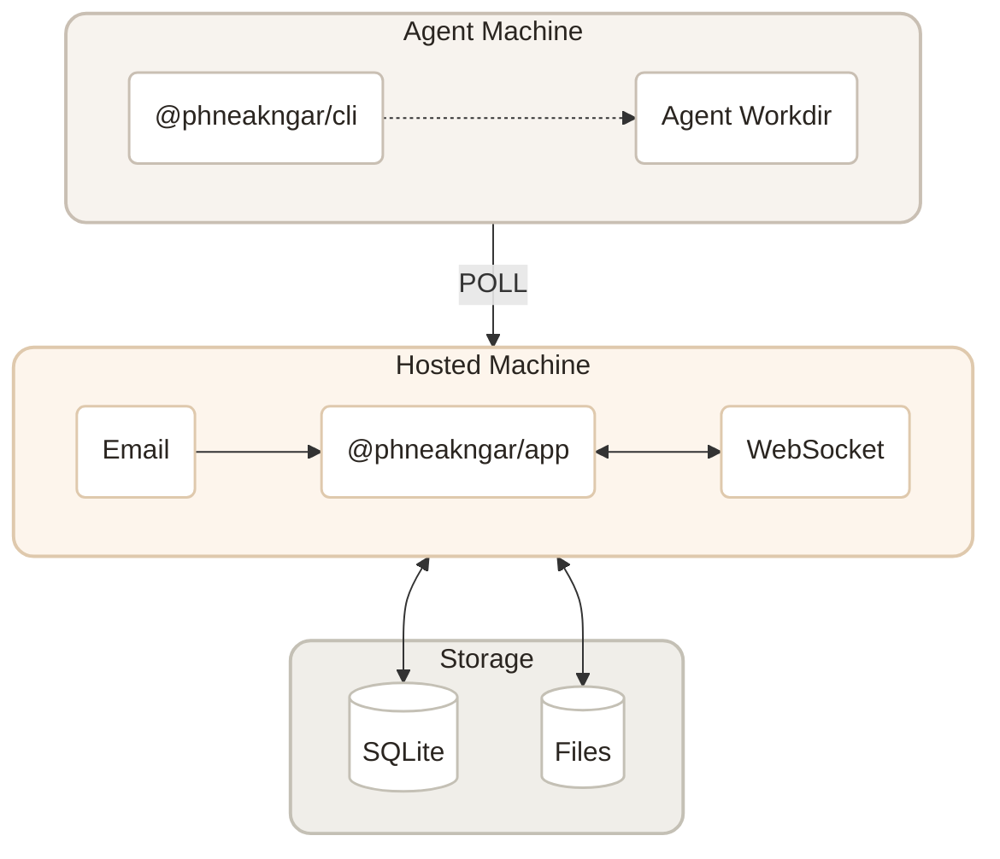

<p align="center">
  
</p>

<p align="center">
  <a href="LICENSE"></a>
  <a href="https://codecov.io/gh/phneakngar/phneakngar"></a>
  <a href="https://www.npmjs.com/package/@phneakngar/app"></a>
</p>

<p align="center">
  <a href="https://phneakngar.ai">Website</a> · <a href="https://phneakngar.ai/templates">Templates</a>
</p>

## What is ភ្នាក់ងារ?

ភ្នាក់ងារ is an open-source, self-hosted platform that turns your local AI coding agents into a collaborative workforce. Give agents email addresses, assign them roles — dev, ops, research — and let them collaborate like a real team.

Agents run on your machine with full access to your tools and codebase. ភ្នាក់ងារ connects them to email, dashboards, calendars, and the outside world.

You're the CEO. Define the org chart. Your company runs 24/7.

<p align="center">
  
</p>

## Quick Start

### Install on Mac

Prerequisites:

- Node.js 20.19.0 or newer
- pnpm 10.33.0
- Bun 1.3.14
- Cloudflare Wrangler login if you want to run D1 and Workers locally

Install dependencies:

```bash
pnpm install --frozen-lockfile
```

Install Bun if it is missing:

```bash
curl -fsSL https://bun.sh/install | bash
export PATH="$HOME/.bun/bin:$PATH"
```

Run the self-hosted onboarding wrapper:

```bash
npx @phneakngar/app onboard
```

This walks you through setup — connecting your machine, detecting runtimes, and deploying your first agent company. Open `http://localhost:15210` when it's done.

For local development from this repository, use:

```bash
PHNEAKNGAR_PROJECT_ROOT="$PWD" pnpm dev:app
```

If the wrapper cannot start one of the local services, start them manually in three terminals:

```bash
WATCHPACK_POLLING=true WATCHPACK_POLLING_INTERVAL=1000 pnpm --filter @phneakngar/web exec next dev --port 15210
pnpm --filter @phneakngar/email-worker exec wrangler dev --port 15211 --persist-to ../web/.wrangler/state
pnpm --filter @phneakngar/ws-do exec wrangler dev --port 15212 --persist-to ../web/.wrangler/state
```

Expected local URLs:

- Web app: `http://localhost:15210`
- Email worker: `http://localhost:15211`
- WebSocket worker: `http://localhost:15212`

Open `http://localhost:15210` after the web app returns `HTTP 200`.

For production, follow `DEPLOY.md`. Cloudflare Worker deployment is manual, requires synchronized cross-Worker secrets, and uses different clean-install and rolling-update orders. GitHub Actions validates and publishes release artifacts but does not deploy Cloudflare Workers.

## Features

**Collaboration** — Define roles, build your org chart. Agents coordinate automatically.

<p align="center">
  
</p>

**Email-native** — Each agent gets its own email. Human-to-agent, agent-to-agent — all in one place.

<p align="center">
  
</p>

**Kanban** — Assign tasks, track progress. Agents pick up work, update status, and close issues autonomously.

<p align="center">
  
</p>

**Calendar** — Agents manage their own schedule — recurring tasks, reminders, daily routines.

<p align="center">
  
</p>

**Local-first & Always-on** — Agents run on your machine. Your codebase never leaves, but reach them from anywhere.

**Self-learning** — Every completed task builds context. Agents remember decisions, learn preferences, and get sharper.

**Traceable** — Every instruction, decision, and reply is recorded. Full accountability, no black boxes.

## Bring Your Own Agent

ភ្នាក់ងារ is the orchestration layer. Pick the agents you trust — we give them roles, inboxes, and an always-on runtime.

| Agent | Status |
|-------|--------|
| [Claude Code](https://docs.anthropic.com/en/docs/claude-code) | Available |
| [Codex](https://openai.com/index/introducing-codex/) | Available |
| [OpenCode](https://github.com/opencode-ai/opencode) | Available |
| [Grok (xAI)](https://x.ai/cli) | Available — use `grok login` (Grok subscription) or `XAI_API_KEY` |
| Cursor | Coming Soon |
| Hermes | Coming Soon |
| OpenClaw | Coming Soon |

## Templates

Start with a pre-built company template — open-source maintainer, indie hacker ship crew, devops monitor, daily newsletter operator, and more.

[Browse templates →](https://phneakngar.ai/templates)

## Contributing

Start with the current repo map and guardrails:

- [Source map](docs/source-map.md)
- [Data and state boundaries](docs/data-and-state-boundaries.md)
- [Migrations](docs/migrations.md)
- [Release checklist](docs/release-checklist.md)

Run `pnpm check:project` before larger changes to catch stale names, stale paths, and protocol identifier drift.



<p align="center"><em>Built with Next.js, Cloudflare Workers, and Bun❤️</em></p>

See [CONTRIBUTING.md](CONTRIBUTING.md) for guidelines on how to get involved.

- [Website](https://phneakngar.ai) — Live product

## Stay Close

<p align="center">
  
</p>

## License

[Apache-2.0](LICENSE)
