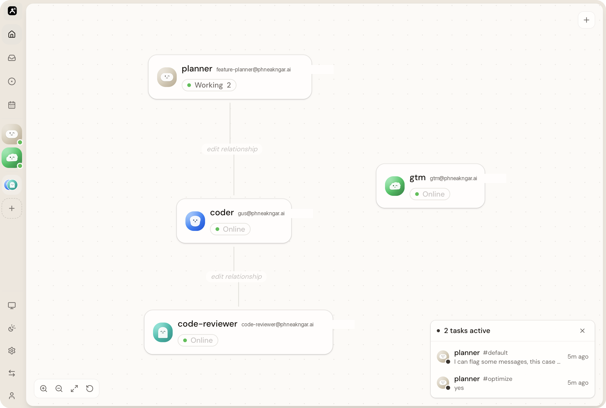
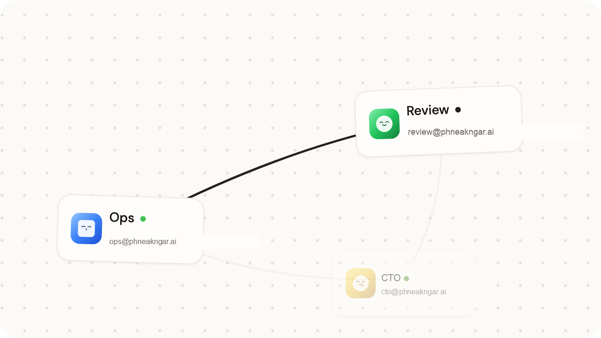
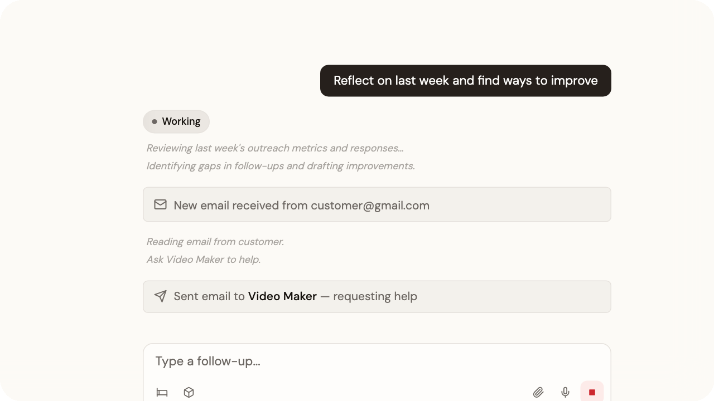
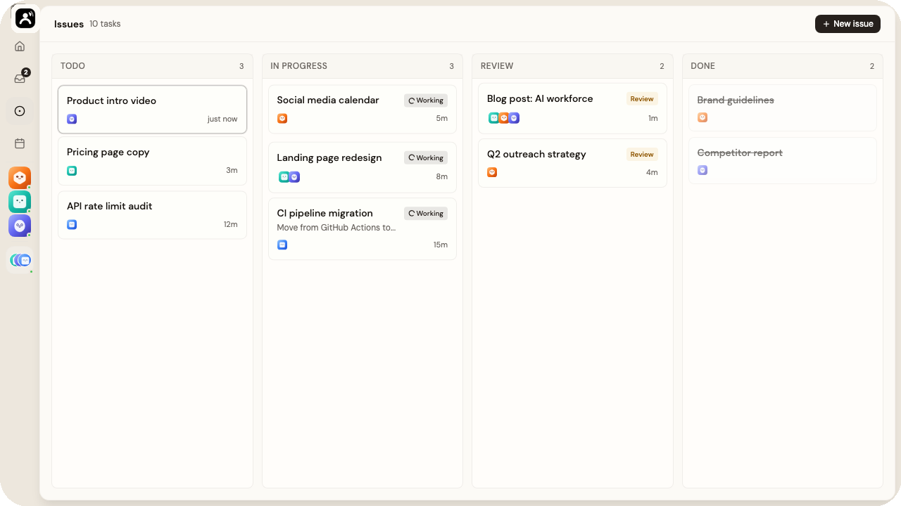
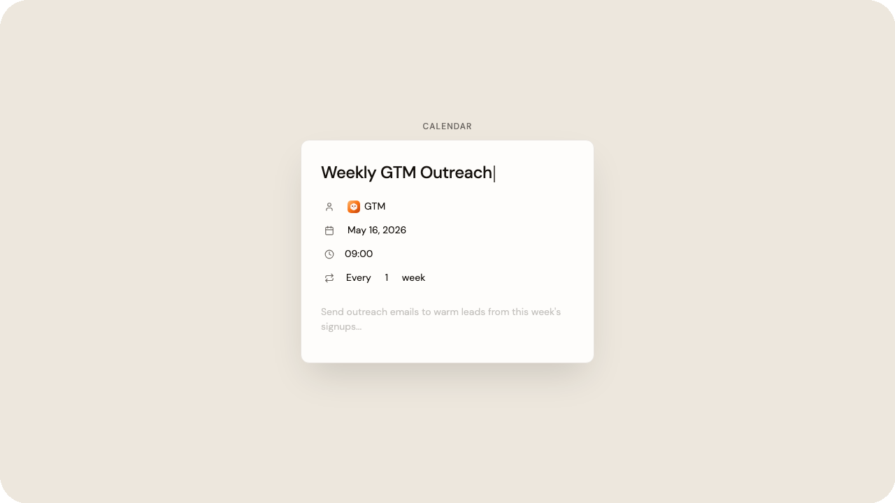
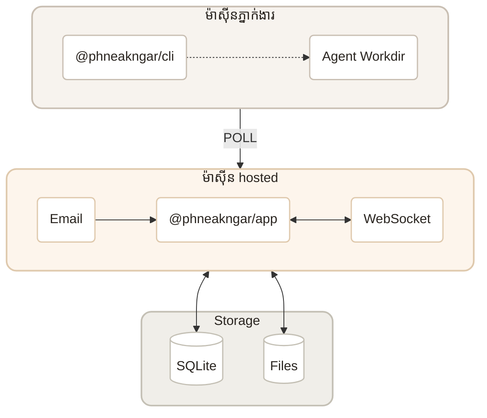

<p align="center">
  
</p>

<p align="center">
  <a href="LICENSE"></a>
  <a href="https://www.npmjs.com/package/@phneakngar/app"></a>
</p>

<p align="center">
  <a href="https://phneakngar.ai">គេហទំព័រ</a>
  ·
  <a href="https://phneakngar.ai/templates">គំរូ</a>
  ·
  <a href="README.km.md">មគ្គុទេសក៍ដំឡើង (KH)</a>
</p>

## ភ្នាក់ងារ គឺជាអ្វី?

**ភ្នាក់ងារ** គឺជាវេទិកា open-source ដែលអ្នកអាច self-host បាន។ វាបំប្លែង AI coding agents ក្នុងមូលដ្ឋានរបស់អ្នកឱ្យក្លាយជាក្រុមការងារដែលសហការគ្នា។ Agents នីមួយៗមានអ៊ីមែល តួនាទី និង runtime ដែលបើកដំណើរការ ២៤ ម៉ោង។

Agents រត់លើម៉ាស៊ីនរបស់អ្នក ជាមួយសិទ្ធិចូលប្រើឧបករណ៍ និង codebase ពេញលេញ។ ភ្នាក់ងារ តភ្ជាប់ពួកគេទៅអ៊ីមែល ផ្ទាំងគ្រប់គ្រង ប្រតិទិន និងពិភពខាងក្រៅ។

អ្នកគឺជា CEO។ កំណត់រចនាសម្ព័ន្ធអង្គភាព — ក្រុមហ៊ុនរបស់អ្នកដំណើរការ ២៤/៧។

<p align="center">
  
</p>

## ចាប់ផ្តើមរហ័ស

### ដំឡើងលើ Mac

**តម្រូវការ៖**

- Node.js `20.19.0` ឬថ្មីជាង
- pnpm `10.33.0`
- Bun `1.3.14`
- Cloudflare Wrangler (សម្រាប់ D1 និង Workers ក្នុងមូលដ្ឋាន)

**ដំឡើង dependencies៖**

```bash
pnpm install --frozen-lockfile
```

**ដំឡើង Bun (បើមិនទាន់មាន)៖**

```bash
curl -fsSL https://bun.sh/install | bash
export PATH="$HOME/.bun/bin:$PATH"
```

**ដំណើរការ onboarding៖**

```bash
npx @phneakngar/app onboard
```

វានាំអ្នកតាមការភ្ជាប់ម៉ាស៊ីន រក runtime និងដាក់ភ្នាក់ងារដំបូង។ បើក `http://localhost:15210` នៅពេលរួច។

**អភិវឌ្ឍពី repo នេះ៖**

```bash
PHNEAKNGAR_PROJECT_ROOT="$PWD" pnpm dev:app
```

ប្រសិនបើសេវាមិនចាប់ផ្តើម សូមបើក ៣ terminal៖

```bash
WATCHPACK_POLLING=true WATCHPACK_POLLING_INTERVAL=1000 pnpm --filter @phneakngar/web exec next dev --port 15210
pnpm --filter @phneakngar/email-worker exec wrangler dev --port 15211 --persist-to ../web/.wrangler/state
pnpm --filter @phneakngar/ws-do exec wrangler dev --port 15212 --persist-to ../web/.wrangler/state
```

| សេវា | URL |
|------|-----|
| Web app | `http://localhost:15210` |
| Email worker | `http://localhost:15211` |
| WebSocket worker | `http://localhost:15212` |

សម្រាប់ production សូមអាន [`DEPLOY.md`](DEPLOY.md)។ ការដាក់ Cloudflare Workers គឺ**ដោយដៃ** — GitHub Actions ធ្វើ validation និង publish ប៉ុន្តែ**មិន** auto-deploy Workers។

## មុខងារសំខាន់

**សហការ** — កំណត់តួនាទី បង្កើត org chart។ Agents សម្របសម្រួលដោយស្វ័យប្រវត្តិ។

<p align="center">
  
</p>

**អ៊ីមែលជាធម្មជាតិ** — ភ្នាក់ងារនីមួយៗមានអ៊ីមែលផ្ទាល់ខ្លួន។ មនុស្ស↔ភ្នាក់ងារ និងភ្នាក់ងារ↔ភ្នាក់ងារ ក្នុងកន្លែងតែមួយ។

<p align="center">
  
</p>

**Kanban** — ផ្តល់ភារកិច្ច តាមដានវឌ្ឍនភាព។ Agents យកការងារ ធ្វើបច្ចុប្បន្នភាពស្ថានភាព និងបិទ issue ដោយខ្លួនឯង។

<p align="center">
  
</p>

**ប្រតិទិន** — Agents គ្រប់គ្រងកាលវិភាគ ការងារម្តងហើយម្តងទៀត និងការរំលឹក។

<p align="center">
  
</p>

**Local-first & បើកជានិច្ច** — Agents រត់លើម៉ាស៊ីនអ្នក។ Codebase មិនចាកចេញ ប៉ុន្តែអាចទាក់ទងពីគ្រប់ទីកន្លែង។

**រៀនដោយខ្លួនឯង** — ភារកិច្ចដែលបញ្ចប់បង្កើត context។ Agents ចងចាំការសម្រេចចិត្ត និងរៀនចំណូលចិត្ត។

**អាចតាមដានបាន** — រាល់ការណែនាំ ការសម្រេច និងការឆ្លើយតបត្រូវបានកត់ត្រា។

## យកភ្នាក់ងារដែលអ្នកទុកចិត្តមកប្រើ

ភ្នាក់ងារ គឺជាស្រទាប់សម្របសម្រួល។ ជ្រើសភ្នាក់ងារដែលអ្នកទុកចិត្ត — យើងផ្តល់តួនាទី ប្រអប់សំបុត្រ និង runtime បើកជានិច្ច។

| Agent | ស្ថានភាព |
|-------|---------|
| [Claude Code](https://docs.anthropic.com/en/docs/claude-code) | រួចរាល់ |
| [Codex](https://openai.com/index/introducing-codex/) | រួចរាល់ |
| [OpenCode](https://github.com/opencode-ai/opencode) | រួចរាល់ |
| [Grok (xAI)](https://x.ai/cli) | រួចរាល់ — `grok login` (subscription) ឬ `XAI_API_KEY` |
| Cursor | ឆាប់ៗ |
| Hermes | ឆាប់ៗ |
| OpenClaw | ឆាប់ៗ |

## គំរូ (Templates)

ចាប់ផ្តើមពីគំរូក្រុមហ៊ុនដែលរៀបចំរួច — open-source maintainer, indie hacker, devops, newsletter និងផ្សេងៗ។

[មើលគំរូ →](https://phneakngar.ai/templates)

## រួមចំណែក

អានផែនទី repo និងវិន័យ៖

- [Source map](docs/source-map.md)
- [Data and state boundaries](docs/data-and-state-boundaries.md)
- [Migrations](docs/migrations.md)
- [Release checklist](docs/release-checklist.md)

ដំណើរការ `pnpm check:project` មុនពេលផ្លាស់ប្តូរធំៗ។



<p align="center"><em>សាងសង់ដោយ Next.js, Cloudflare Workers និង Bun ❤️</em></p>

មើល [CONTRIBUTING.md](CONTRIBUTING.md) សម្រាប់វិធីចូលរួម។

- [គេហទំព័រ](https://phneakngar.ai) — ផលិតផលផ្ទាល់

## ស្នើសុំផ្កាយ

<p align="center">
  
</p>

## អាជ្ញាប័ណ្ណ

[Apache-2.0](LICENSE)
