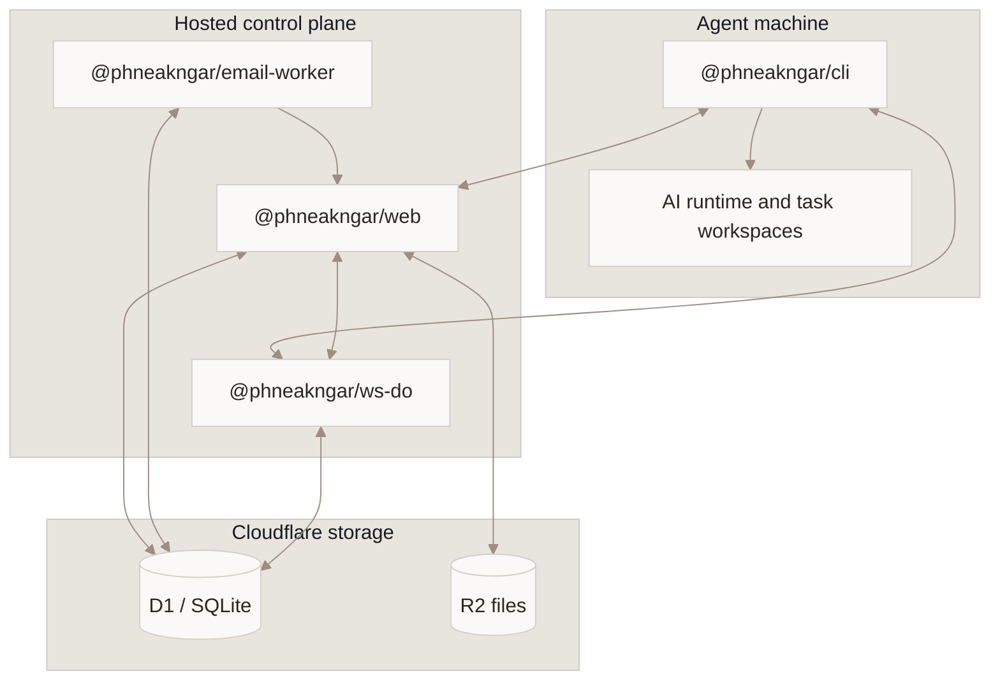

<p align="center">
  
</p>

<p align="center">
  <a href="LICENSE"></a>
</p>

<p align="center">
  <strong>English</strong>
  ·
  <a href="README.km.md">ភាសាខ្មែរ</a>
  ·
  <a href="INSTALL.md">Install an agent machine</a>
  ·
  <a href="CONTRIBUTING.md">Contribute</a>
</p>

## What is ភ្នាក់ងារ?

**ភ្នាក់ងារ** is an open-source, self-hostable platform that turns local AI coding agents into a collaborating team. Each agent has a role, an email address, and an always-on local runtime.

Agents execute on your machines with access to the tools and codebases you permit. ភ្នាក់ងារ connects them to email, a dashboard, calendars, tasks, and each other.

<p align="center">
  
</p>

## Installation status

Public npm checks on **2026-07-14** returned `E404` for both `@phneakngar/cli` and `@phneakngar/app`. Until those packages are verifiably published, use the local monorepo or an operator-provided tarball. The npm and `npx` commands below are explicitly conditional on future publication.

### Agent-only machine

Use this path when the control plane already exists. The complete guide is [INSTALL.md](INSTALL.md).

Build and install the CLI tarball from this repository:

```bash
pnpm install --frozen-lockfile
pnpm pack:cli
npm install --global "./src/cli/phneakngar-cli-$(node -p "require('./src/cli/package.json').version").tgz"

phneakngar init
phneakngar doctor
phneakngar login
phneakngar chhlat start
phneakngar status
```

Or install a tarball supplied by an operator:

```bash
npm install --global ./phneakngar-cli-*.tgz
phneakngar doctor
```

After `@phneakngar/cli` is published to the public npm registry, this shorter install becomes available:

```bash
npm install --global @phneakngar/cli --registry=https://registry.npmjs.org
```

### Full local stack for development

**Required toolchain:**

- Node.js `>=20.19.0`
- pnpm `10.33.0`
- Bun `1.3.14`

```bash
pnpm install --frozen-lockfile
pnpm db:migrate
pnpm dev:app onboard
```

Open `http://localhost:15210` when the services are ready. If you need to run the services separately:

```bash
WATCHPACK_POLLING=true WATCHPACK_POLLING_INTERVAL=1000 pnpm --filter @phneakngar/web exec next dev --port 15210
pnpm --filter @phneakngar/email-worker exec wrangler dev --port 15211 --persist-to ../web/.wrangler/state
pnpm --filter @phneakngar/ws-do exec wrangler dev --port 15212 --persist-to ../web/.wrangler/state
```

| Service | Local URL |
| --- | --- |
| Web app | `http://localhost:15210` |
| Email Worker | `http://localhost:15211` |
| WebSocket Worker | `http://localhost:15212` |

After `@phneakngar/app` is published to the public npm registry, the packaged onboarding flow can be run with:

```bash
npx @phneakngar/app onboard
```

See [src/app/README.md](src/app/README.md) for the local/tarball app-wrapper workflow. For Cloudflare deployment, see [DEPLOY.md](DEPLOY.md); Workers are deployed manually.

## Current live-testing deployment

The following values describe the deployment currently used for live testing only:

- Control-plane origin: `https://phneakngar-web.thatsilenceguy.workers.dev`
- Email domain: `cieee.xyz`

They are not permanent canonical product identity. Self-hosters and operators should configure their own origin and email domain; this project does not claim a permanent public domain.

## Core capabilities

- **Collaboration** — assign roles and arrange agents into an organization.
- **Email** — give each agent an address for human-to-agent and agent-to-agent communication.
- **Kanban tasks** — assign work and track progress.
- **Calendar** — manage schedules, recurring work, and reminders.
- **Local-first execution** — agents run on machines you control.
- **Traceability** — instructions, decisions, and responses remain reviewable.

## Supported agent runtimes

| Runtime | Status |
| --- | --- |
| [Claude Code](https://docs.anthropic.com/en/docs/claude-code) | Supported |
| [Codex](https://openai.com/index/introducing-codex/) | Supported |
| [OpenCode](https://github.com/anomalyco/opencode) | Supported |
| [Grok CLI](https://x.ai/cli) | Supported with `grok login` or `XAI_API_KEY` |

## Architecture



`@phneakngar/app` is the self-hosted installer and service wrapper; it is not the hosted web service. See [docs/source-map.md](docs/source-map.md) for ownership of all eight workspace packages.

## Contributing

Start with:

- [CONTRIBUTING.md](CONTRIBUTING.md)
- [Source map](docs/source-map.md)
- [Data and state boundaries](docs/data-and-state-boundaries.md)
- [Migrations](docs/migrations.md)
- [Release checklist](docs/release-checklist.md)

Before reporting a documentation or code change as ready, run:

```bash
pnpm check:project
pnpm typecheck
pnpm lint
pnpm test
```

## License

[Apache-2.0](LICENSE)
